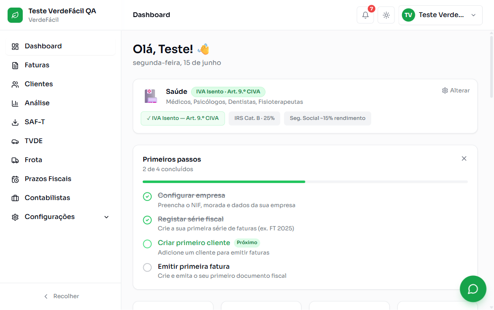
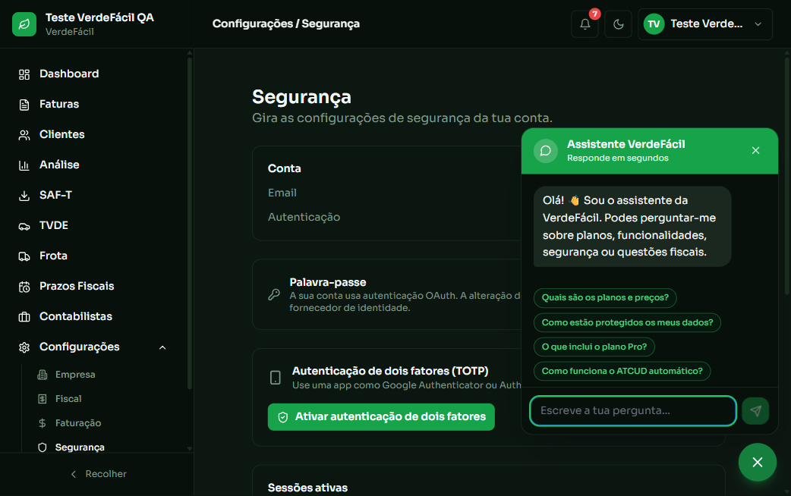
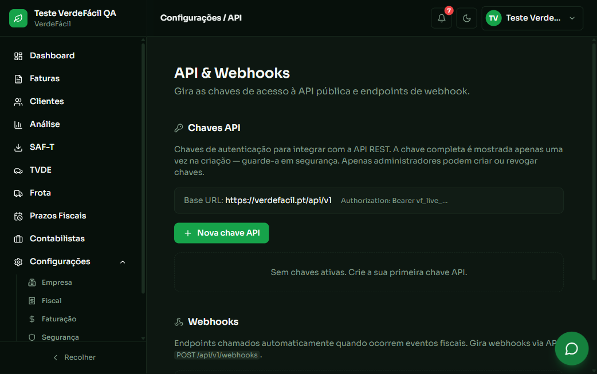

# VerdeFácil — plataforma de faturação e obrigações fiscais (Portugal)

SaaS multi-tenant para trabalhadores independentes e pequenas empresas: emissão de
faturas e recibos com conformidade fiscal portuguesa, delegação de acesso a
contabilistas, assistente fiscal com modelos de linguagem, e automações de cobrança,
prazos e exportação SAF-T.

**Projeto próprio, construído do zero** — ideia, modelo de dados, arquitetura, código,
testes e infraestrutura. Autoria individual, de 25/05/2026 a 07/10/2026.

> **Este repositório é uma vitrine técnica, não o código-fonte.** O produto está em
> pré-lançamento, com lógica de negócio proprietária e base de dados de utilizadores
> reais — não é publicável. O que está aqui é a arquitetura, as decisões técnicas, a
> estrutura de pastas e os números, todos medidos no repositório privado.
> **Acesso de leitura ao código, ou visita guiada em entrevista, a pedido.**

---

## Números — medidos a 2026-10-07, não estimados

| | |
|---|---|
| Código | **~74.000 linhas**: 34.483 em `.ts` (211 fich.) · 34.313 em `.tsx` (194 fich.) · 5.072 em `.sql` (44 fich.) |
| Base de dados | **28 modelos** Prisma · 18 enums · 45 relações · 35 índices · schema de 1.111 linhas |
| Segurança na BD | **139 políticas RLS** · 54 tabelas com Row Level Security · FORCE RLS aplicado |
| API | **51 rotas** REST, das quais **10 públicas versionadas** (`/api/v1`) com OpenAPI |
| Lógica de negócio | 19 server actions · 72 módulos em `src/lib` |
| Automação | **8 cron jobs** agendados · **6 webhooks** · 5 workers com filas |
| Testes | **199 testes automatizados** a passar (20 suites de certificação fiscal, 8 unitárias, 6 E2E) |
| Histórico | **345 commits** · 16 branches · 13 pull requests · 4 workflows de CI |

Reproduzível: `npx tsc --noEmit` → 0 erros · `npx vitest run` → 199/199 · `npm run build` → sucesso.

---

## O produto

<table>
<tr>
<td width="50%"></td>
<td width="50%"></td>
</tr>
<tr>
<td>Dashboard — as regras fiscais aplicadas (isenção de IVA, categoria de IRS, Segurança Social) são determinadas pela <strong>profissão</strong> da organização</td>
<td>Análise financeira — faturação, IVA liquidado, retenção, prazo médio de recebimento e concentração de cliente</td>
</tr>
<tr>
<td></td>
<td></td>
</tr>
<tr>
<td>Assistente fiscal sobre modelos de linguagem, e autenticação de dois fatores (TOTP)</td>
<td>API pública: emissão de chaves e subscrição de webhooks pelo próprio cliente</td>
</tr>
</table>

<sub>Capturas de uma organização de teste — sem dados de utilizadores reais.</sub>

---

## Arquitetura

```
Next.js 15 (App Router) ─┬─ React 19 + TypeScript + Tailwind     interface
                         ├─ Server Actions                       escrita com validação Zod
                         └─ Route Handlers (/api)                REST + webhooks + crons
                                    │
                  ┌─────────────────┼──────────────────┐
                  │                 │                  │
            Prisma ORM        BullMQ + Redis      Modelos de linguagem
                  │            (5 workers)        (cadeia de 4 provedores)
                  │                 │                  │
          PostgreSQL (Supabase)   PDF · SAF-T      assistente · OCR · voz
          RLS + FORCE RLS          email · fiscal
```

**Separação de responsabilidades:** as rotas e as actions não contêm regras de negócio
— validam a entrada (Zod), verificam permissões e delegam para `src/lib`. O domínio
fiscal está isolado em `src/lib/fiscal` (20 módulos), atrás de uma abstração de
provedor que permite trocar o canal de comunicação com a Autoridade Tributária
(AT direta, InvoiceXpress, Moloni) sem tocar nas rotas.

---

## Competências demonstradas, e onde estão no código

### Frontend — interfaces ligadas a serviços de backend

194 ficheiros em `src/app`, 56 componentes reutilizáveis. Três áreas distintas:
aplicação autenticada (74 ficheiros), site de marketing (36) e painel de operação
interna (9). Formulários com `react-hook-form` + resolvers Zod — **o mesmo schema
valida no cliente e no servidor**, pelo que não há divergência entre o que a interface
aceita e o que a base de dados permite.

### Backend — lógica de negócio e serviços

19 server actions para escrita, 51 route handlers para API e integrações. TypeScript
em todo o stack. Os módulos de domínio (`src/lib/fiscal`, `payments`, `invoices`,
`expenses`, `fleet`, `tvde`) não conhecem HTTP — são testáveis isoladamente, e é isso
que as 199 suites fazem.

### Base de dados — modelação, integridade e consultas

PostgreSQL via Prisma. 28 modelos com 45 relações explícitas e integridade garantida
na BD, não só na aplicação: 7 chaves únicas compostas, entre elas a que impede dois
documentos emitidos com o mesmo número na mesma série.

**Evolução da estrutura:** 37 migrações versionadas (12 ativas + 25 arquivadas). Os
nomes contam a história — `performance_indexes`, `audit_logs_immutable`, `rls_policies`,
`trgm_indexes` (pesquisa textual com trigramas), `force_rls`,
`revoke_audit_logs_mutation`, `lock_down_session_definer_functions`,
`phase5_tenant_isolation_policies`.

**Isolamento multi-tenant em profundidade:** 139 políticas RLS sobre 54 tabelas, com
FORCE RLS — nem a aplicação consegue contornar o isolamento por engano. Validado em
produção com duas organizações reais: tentativas de acesso direto a registos de outra
organização, nas duas direções, redirecionam sem fuga de dados.

### APIs REST — consumo, desenvolvimento, autenticação e erros

API pública versionada `/api/v1`: clientes, faturas (criar, obter, cancelar, PDF),
exportações SAF-T e gestão de webhooks. **Contrato publicado em
`/api/v1/openapi.json`**, autenticação por chave de API com permissões por organização.

**Webhooks de saída** para os clientes da API, com validação do URL de destino
(`webhook-url-validator.ts`) para impedir que um cliente registe um endereço interno e
use a plataforma para alcançar a rede privada — SSRF.

**Integrações recebidas:** Stripe (pagamentos e ciclo de subscrição), EasyPay
(Multibanco/MB WAY), Telegram e WhatsApp (faturação por mensagem), VIES (validação de
NIF intracomunitário).

### IA aplicada — a parte que não é um wrapper

| Funcionalidade | Como está feito |
|---|---|
| **Assistente fiscal** (`/api/ia/ask`) | Cadeia de degradação em 5 níveis: Gemini → Groq → OpenRouter → Claude → resposta estática. Um provedor em baixo, ou sem quota, não derruba a funcionalidade |
| **OCR de recibos** (`/api/expenses/ocr`) | Fotografia → extração estruturada por visão. **Nunca grava nada**: devolve campos para um formulário que a pessoa revê e confirma |
| **Fatura por voz** | Áudio → Whisper ou Gemini multimodal → texto → parser que devolve dados de fatura estruturados |
| **Assistente público** (`/api/chat/public`) | Sem autenticação, com rate limit de 5 pedidos/minuto por IP |

**A decisão técnica de que tenho mais orgulho nesta camada:** o upload do OCR passa por
**sete validações antes de qualquer byte sair para a API externa** — autenticação, rate
limit, `content-length`, estrutura multipart, tamanho real, MIME declarado e *magic
bytes* do ficheiro. Enviar primeiro e validar depois seria mais simples e transformaria
o endpoint num proxy aberto para a conta de IA.

### Automação — webhooks, pipelines e trabalho agendado

**8 cron jobs** em produção: cobranças em atraso, prazos fiscais, faturação recorrente,
avisos de fim de período experimental, limpeza RGPD, revisão anual das constantes
fiscais, alertas de conformidade e um *watchdog* que verifica base de dados, Redis,
SAF-T pendente e erros fiscais não resolvidos — e alerta quando encontra problemas.

**5 workers** sobre filas Redis para o trabalho que não pode bloquear um pedido HTTP:
geração de PDF, exportação SAF-T, comunicação fiscal e envio de email.

**Rollback automático:** um workflow do GitHub Actions monitoriza o site em produção e,
se as verificações falharem, reverte o deploy e envia alerta.

### Segurança

- **Autorização por capacidades (CBAC)**, verificada em 37 ficheiros — permissões por
  organização e por papel, não um booleano de administrador
- **Delegação a contabilistas** com convites expiráveis e matriz de capacidades
- **MFA TOTP** com segredos cifrados
- **Registo de auditoria imutável** — os privilégios de alteração foram revogados na
  própria base de dados, por migração; nem com a chave de serviço se reescreve o passado
- **Rate limiting** nas ações sensíveis e nos endpoints públicos
- **Relatórios CSP** recolhidos em `/api/csp-report`
- **Verificação automática no CI** (`check-env-safety`) que recusa clientes externos
  instanciados em module-scope e acessos a variáveis de ambiente com `!`

### Testes e depuração

**199 testes** a passar. O grupo mais interessante é a **certificação fiscal** — 20
suites que validam invariantes legais em lugar de implementação:

- nunca existem dois documentos emitidos com o mesmo número
- apagar um rascunho **não** deixa um buraco na numeração emitida
- a cadeia de hash segue a ordem de **emissão**, nunca encadeia num número maior
- a data de entrada no sistema persistida é igual à declarada no SAF-T **e** à assinada
  no hash (assinatura RSA)

Correm contra um PostgreSQL real e efémero (PGlite), não contra mocks.

---

## Problemas resolvidos — os que valem contar

**Uma verificação de permissões que falhava em aberto** (PR #17,
`fix/sec-01-cbac-fail-open`). Quando a consulta de capacidades não devolvia resultado,
o caminho de erro concedia acesso em vez de o negar. Encontrado a ler o código de
autorização à procura exatamente deste padrão, não por um teste a falhar — um teste que
só verifica o caminho feliz nunca o apanharia.

**Uma credencial de produção em texto limpo no histórico Git.** Auditei os 1.477
ficheiros versionados e os 5.389 objetos de todas as 29 referências do repositório.
Os scans por padrões de chave de API (`sk_live_`, JWT, `AIza…`) deram tudo limpo — e
estavam a mentir: a credencial mais grave estava escrita em prosa num markdown, como
`email / password`, invisível a qualquer expressão regular de chave. Só um segundo scan
dirigido a passwords a encontrou. **Lição aplicada:** varrer sempre também a prosa —
documentação e changelogs — não apenas o código.

**Uma suite de testes que mentia sobre o seu próprio estado.** O `exclude` do Vitest
estava como `node_modules/**`, que só cobre a raiz: os `node_modules` aninhados de uma
ferramenta auxiliar traziam 56 ficheiros de teste de terceiros para a suite e punham-na
vermelha sem existir uma única falha do projeto. Com a suite vermelha por omissão, uma
regressão real passava sem se ver.

**Um `.env.local` com uma variável vazia a anular o `.env`.** Os testes E2E
autenticados foram declarados impossíveis de correr localmente. Eram possíveis: havia
uma `DATABASE_URL=""` vazia no `.env.local`, que **tem precedência** sobre o `.env`, e
anulava o valor bom. O diagnóstico inicial estava errado e ficou registado como
correção, para não se repetir.

---

## Como foi construído — processo e uso de IA

Trabalhei com assistentes de IA (Claude) como acelerador de implementação, mantendo as
decisões de arquitetura, o modelo de dados e os critérios de aceitação do meu lado. O
que faz isto funcionar é o protocolo de verificação, não a ferramenta:

- **uma alteração de cada vez**, com medição antes e depois
- **nunca alterar um teste para ele passar**
- **distinguir sempre o medido do assumido** — e dizê-lo
- **diagnosticar antes de corrigir**

Este protocolo apanha erros com regularidade — incluindo erros das próprias propostas
da IA. Os quatro problemas da secção anterior foram todos encontrados assim: a
permissão que falhava em aberto, a credencial que os scans automáticos não viram, a
suite de testes que se reportava mal e o diagnóstico errado que estava registado como
facto. É por isso que considero a verificação a competência central aqui, e a geração
de código a parte mais fácil.

---

## Stack

**Frontend** Next.js 15 · React 19 · TypeScript · Tailwind CSS 4 · Radix UI · GSAP ·
`react-hook-form` + Zod
**Backend** Next.js Route Handlers · Server Actions · Prisma ORM · BullMQ
**Dados** PostgreSQL (Supabase) · Redis (Upstash) · RLS/FORCE RLS
**IA** Gemini · Groq · OpenRouter · Claude · Whisper
**Integrações** Stripe · EasyPay · Resend · Telegram · WhatsApp · VIES · AT (SAF-T,
assinatura RSA)
**Qualidade** Vitest · Playwright · PGlite · ESLint · GitHub Actions (4 workflows)
**Infra** Vercel · Railway · Sentry

---

## Estrutura do repositório

Árvore completa em **[ESTRUTURA.md](ESTRUTURA.md)**. Em resumo:

```
src/
  app/            194  rotas: app autenticada (74) · marketing (36) · API (52) · painel interno (9)
  lib/             72  domínio: fiscal (20) · auth (10) · voice-invoice (7) · db (6) · api (4) · …
  components/      56  componentes de interface
  actions/         19  server actions (escrita, com validação Zod)
  workers/          6  filas: PDF · SAF-T · fiscal · email
prisma/
  schema.prisma        28 modelos · 45 relações · 35 índices
  migrations/      37  migrações versionadas (12 ativas + 25 arquivadas)
supabase/             políticas RLS e configuração
tests/
  certification/   24  invariantes fiscais: numeração · hash chain · assinatura · auth
  unit/             8
  e2e/              6  Playwright
.github/workflows/  4  CI, smoke tests, monitorização, watchdog de deploy
```

---

## Autoria

**Sarynne Coelho Ferreira**
[LinkedIn](https://www.linkedin.com/in/sarynne-coelho-ferreira) · Porto, Portugal

Disponível para dar acesso de leitura ao repositório privado, ou para percorrer o
código e as decisões em entrevista.
